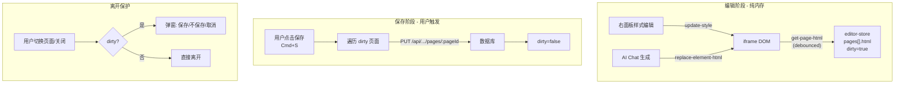
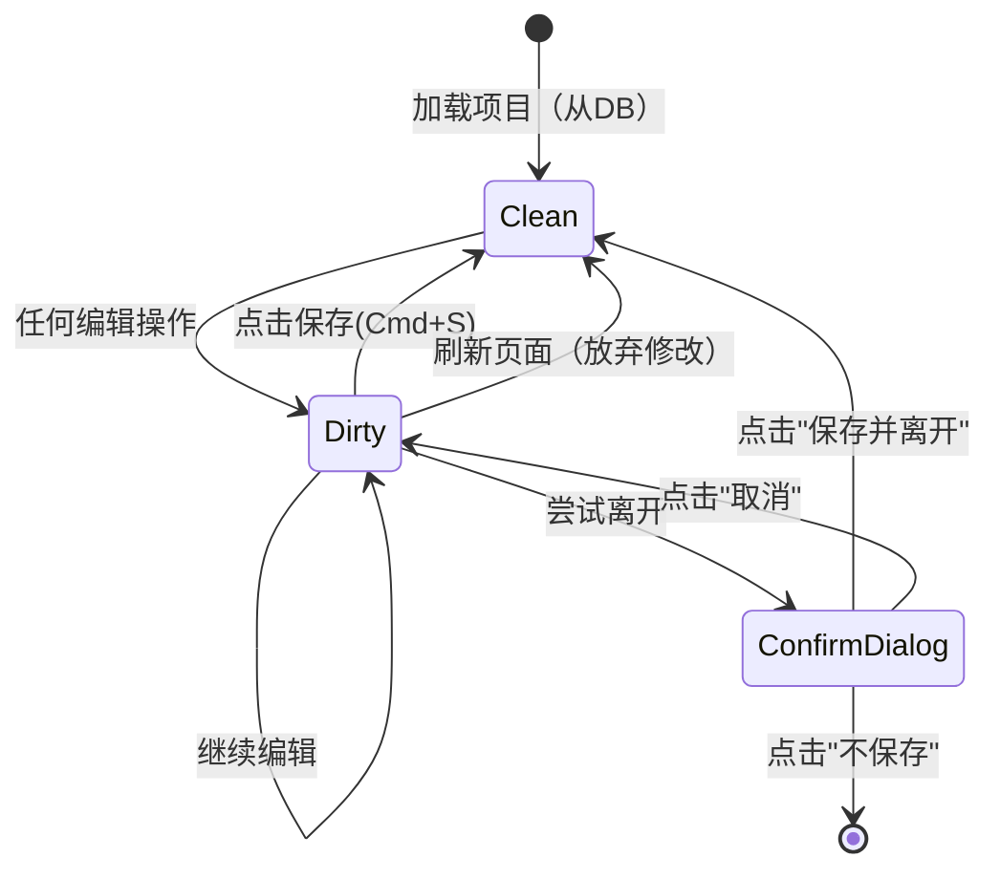

# Canvas 画布编辑器 — 手动保存架构方案

## 核心设计原则

**本地编辑不自动保存，用户主动点击保存才写入数据库，退出时提示保存。**

这比自动保存更安全：用户可以随意试错（包括 AI 生成的结果），不满意直接刷新恢复到上次保存的版本。

---

## 一、新的数据流



---

## 二、具体实现方案

### 2.1 editor-store 变更

在 [editor-store.ts](canvas-editor/src/stores/editor-store.ts) 中：

**新增状态：**

```typescript
interface EditorState {
  // ...现有字段
  dirtyPageIds: Set<string>; // 哪些页面有未保存修改
  saving: boolean; // 保存中状态（已有，复用）
}
```

**新增 actions：**

```typescript
interface EditorActions {
  // ...现有
  markDirty: (pageId?: string) => void; // 标记当前页为 dirty
  save: () => Promise<void>; // 手动保存所有 dirty 页面到 DB
  isDirty: () => boolean; // 是否有未保存修改
  discardChanges: () => void; // 放弃修改，重新从 DB 加载
}
```

**移除：** `debouncedSave` 函数及其调用。`updatePageHTML` 改为只更新 store 内存 + 标记 dirty，不再触发 API 调用。

### 2.2 syncHTMLFromIframe() — 从 iframe 回收 HTML 到 store

```typescript
export function syncHTMLFromIframe(delay = 600) {
  if (_syncTimer) clearTimeout(_syncTimer);
  _syncTimer = setTimeout(async () => {
    const state = useEditorStore.getState();
    if (!state.projectId) return;
    try {
      const resp = await requestFromBridge<{ html: string }>(
        { type: "get-page-html" },
        "page-html",
      );
      const currentPage = state.pages.find((p) => p.id === state.activePageId);
      if (currentPage && currentPage.html !== resp.html) {
        suppressNextIframeReload();
        // 只更新内存，不写 DB
        state.updatePageHTML(state.activePageId, resp.html);
        // updatePageHTML 内部标记 dirty
      }
    } catch {
      /* iframe 未就绪 */
    }
  }, delay);
}
```

**接入点**（统一方案）：在 [use-bridge.ts](canvas-editor/src/hooks/use-bridge.ts) 中监听 `element-rect-update` 消息时自动调用 `syncHTMLFromIframe()`。因为每次 `update-style` 后 bridge 都会发送此消息，这样一个接入点即可覆盖所有右面板编辑。

### 2.3 TopBar 保存按钮

在 [TopBar.tsx](canvas-editor/src/components/TopBar/TopBar.tsx) 中：

- 新增保存按钮（磁盘图标），dirty 时高亮显示
- 绑定 `Cmd+S` / `Ctrl+S` 快捷键
- 点击后调用 `save()` action

```typescript
// save action 实现
save: async () => {
  const state = get();
  if (!state.projectId || state.dirtyPageIds.size === 0) return;
  set({ saving: true });
  try {
    for (const pageId of state.dirtyPageIds) {
      const page = state.pages.find((p) => p.id === pageId);
      if (page) {
        await api.pages.update(state.projectId, pageId, {
          html: page.html,
          title: page.title,
        });
      }
    }
    set((s) => {
      s.dirtyPageIds = new Set();
    });
  } finally {
    set({ saving: false });
  }
};
```

### 2.4 离开提示

在 [EditorPage.tsx](canvas-editor/src/pages/EditorPage.tsx) 中：

1. **浏览器关闭/刷新**：`beforeunload` 事件，dirty 时阻止并提示
2. **路由跳转**（回项目列表）：`react-router` 的 `useBlocker` 或 `beforeunload`，弹出确认对话框

```typescript
useEffect(() => {
  const handler = (e: BeforeUnloadEvent) => {
    if (useEditorStore.getState().isDirty()) {
      e.preventDefault();
      e.returnValue = "";
    }
  };
  window.addEventListener("beforeunload", handler);
  return () => window.removeEventListener("beforeunload", handler);
}, []);
```

路由级别使用 react-router v7 的 `unstable_useBlocker`（或自行在返回按钮的 onClick 中判断 dirty，弹自定义 Modal）。

### 2.5 双击原位文本编辑

在 iframe 中双击文本元素，直接进入编辑模式：

**交互流程：**

1. 用户双击画布上的文字 → overlay 检测到 dblclick
2. 父页面发送 `{ type: 'start-edit', id }` 给 iframe
3. Bridge 对该元素设置 `contentEditable = true`，focus 并选中文本
4. 父页面临时让 iframe `pointer-events: auto`（overlay 隐藏或 pass-through）
5. 用户直接在 iframe 中编辑文字
6. 用户点击其他地方 / 按 Escape → bridge 发送 `{ type: 'edit-done', id, text }` 给父页面
7. 父页面恢复 overlay，`syncHTMLFromIframe()` 回收完整 HTML + pushUndo

**需要修改的文件：**

- `bridge-script.ts` — 新增 `start-edit` / 处理 blur 发送 `edit-done`
- `ContentIFrame.tsx` — overlay 的 dblclick handler，编辑中临时切换 pointer-events
- `editor-store.ts` — 新增 `editingTextId` 状态标记正在编辑

### 2.6 AI Chat 的保存行为

当前 [chat-store.ts](canvas-editor/src/stores/chat-store.ts) 中 AI 修改后会调用 `updatePageHTML`。改造后：

- AI 修改仍然即时应用到 iframe + 回收到 store
- 但**不自动写 DB**，只标记 dirty
- 用户看到 AI 结果后：满意则点保存，不满意则 undo 或直接刷新

### 2.6 页面 CRUD 操作

| 操作          | 行为                                                         |
| ------------- | ------------------------------------------------------------ |
| renamePage    | 更新 store 内存 + 标记 dirty                                 |
| deletePage    | 从 store 移除 + 标记 dirty（保存时用整个 pages 数组覆盖 DB） |
| duplicatePage | 加入 store + 标记 dirty                                      |
| addPage       | 加入 store + 标记 dirty                                      |

保存时统一调用 `PUT /api/projects/:id/pages/:pageId` 更新每个 dirty 页面。对于删除，可以在 save 时额外发一个请求把被删页面从 DB 移除（或后端支持批量同步整个 pages 数组）。

**后端新增端点建议：**`PUT /api/projects/:id/pages`（批量同步整个 pages 数组），比逐个更新更简洁。

---

## 三、Undo/Redo 机制（逐步撤销）

**每次有意义的编辑 = 一个撤销点。** 用户做了 10 次修改，可以 undo 10 步逐一回退，redo 逐一前进。

**工作原理：**

```typescript
// syncHTMLFromIframe 内部
const currentPage = state.pages.find((p) => p.id === state.activePageId);
if (currentPage && currentPage.html !== newHtml) {
  // 1. 旧 HTML 压入 undo 栈（撤销点）
  state.pushUndo();
  // 2. 更新为新 HTML
  suppressNextIframeReload();
  state.updatePageHTML(state.activePageId, newHtml);
  // 3. 清空 redo 栈（有新编辑时 redo 失效，标准行为）
}
```

**Undo/Redo 与保存的关系：**

- 保存不影响 undo/redo 栈 — 保存后仍然可以继续 undo
- Undo/Redo 操作后标记 dirty（因为内存状态可能与 DB 不一致了）
- 如果 undo 回到和 DB 完全一致的状态，可清除 dirty（可选优化，初期不做）
- 极端恢复：刷新页面 = 放弃所有未保存修改，从 DB 重新加载

**每种操作产生的撤销点：**

| 操作                        | 撤销点                |
| --------------------------- | --------------------- |
| 右面板改一个属性（blur 后） | 1 个                  |
| AI 生成/修改页面            | 1 个                  |
| 文本编辑（blur 后）         | 1 个                  |
| 页面改标题                  | 不产生（不影响 HTML） |
| 切换页面                    | 不产生（只切视图）    |

---

## 四、用户体验总结



**TopBar 状态指示：**

- Clean 状态：保存按钮灰色/禁用
- Dirty 状态：保存按钮高亮（蓝色圆点或加粗），标题旁显示小圆点

---

## 五、实施文件清单

| 文件                                             | 改动                                                                                                                 |
| ------------------------------------------------ | -------------------------------------------------------------------------------------------------------------------- |
| `canvas-editor/src/stores/editor-store.ts`       | 移除 debouncedSave；新增 dirtyPageIds / markDirty / save / isDirty / discardChanges；updatePageHTML 只写内存+标dirty |
| `canvas-editor/src/stores/chat-store.ts`         | 移除直接 api.pages.update 调用，改走 updatePageHTML                                                                  |
| `canvas-editor/src/hooks/use-bridge.ts`          | 监听 element-rect-update 时调用 syncHTMLFromIframe                                                                   |
| `canvas-editor/src/components/TopBar/TopBar.tsx` | 添加保存按钮 + Cmd+S 快捷键 + dirty 状态指示                                                                         |
| `canvas-editor/src/pages/EditorPage.tsx`         | 添加 beforeunload + 路由离开保护                                                                                     |
| `canvas-editor/src/services/api.ts`              | 可选：新增 batchUpdatePages 方法                                                                                     |
| `server/src/routes/pages.ts`                     | 可选：新增 PUT /api/projects/:id/pages 批量同步端点                                                                  |
