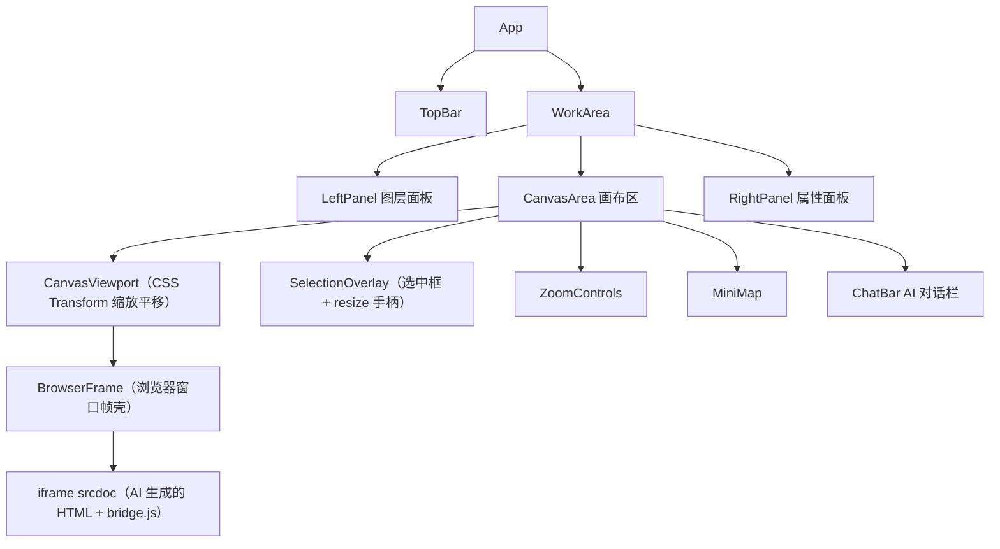
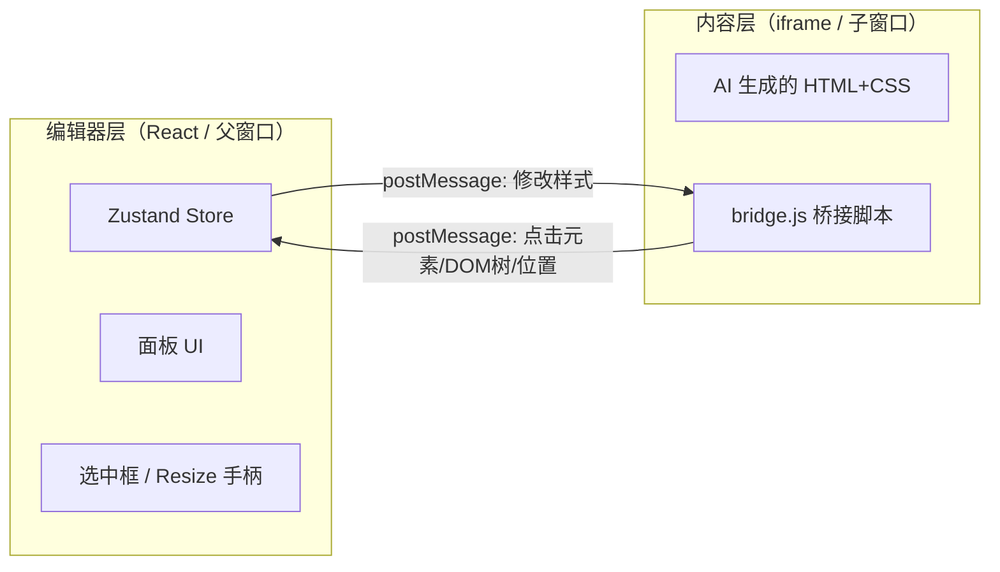

# SpecFlow 画布工作台实现方案（v2 — iframe 架构）

## 核心架构决策

**画布内容 = AI 生成的 HTML 字符串**，不是编辑器的 React 组件。因此：
- 使用 **iframe + srcdoc** 渲染设计内容，提供完整的 JS/CSS/DOM 隔离
- 编辑器通过 **bridge.js**（注入到 iframe 内的脚本）与内容通信
- 选中框、resize 手柄等编辑 UI **覆盖在 iframe 上方**，属于编辑器层

## 技术栈

- React 18 + TypeScript + Vite
- `zustand` + `immer` — 状态管理（页面列表、选区、视口、撤销栈）
- `@use-gesture/react` — 画布缩放/平移手势
- `tailwindcss` — 编辑器 UI 样式（复用设计稿 token）
- `lucide-react` — 图标

## 整体架构



## 关键分层：编辑器层 vs 内容层



### 通信协议（postMessage）

**iframe → 编辑器：**
- `{ type: 'ready' }` — iframe 加载完毕
- `{ type: 'dom-tree', tree: DOMNode[] }` — 解析后的 DOM 树结构（供图层面板）
- `{ type: 'element-click', id, rect }` — 用户点击了某元素
- `{ type: 'element-hover', id, rect }` — 用户 hover 了某元素
- `{ type: 'element-rect-update', id, rect }` — 元素位置变化后的更新
- `{ type: 'html-snapshot', html }` — 当前 DOM 序列化为 HTML（用于 AI 对话/撤销）

**编辑器 → iframe：**
- `{ type: 'update-style', id, styles }` — 修改元素样式
- `{ type: 'update-text', id, text }` — 修改文本内容
- `{ type: 'get-rect', id }` — 请求元素位置
- `{ type: 'highlight', id }` — 高亮某元素（从图层面板联动）
- `{ type: 'clear-highlight' }` — 清除高亮

## 状态管理

```typescript
interface Page {
  id: string;
  title: string;        // "订单列表" / "订单详情" / "导出配置"
  html: string;          // AI 生成的完整 HTML 字符串
  deviceWidth: number;   // 960 | 768 | 375
}

interface DOMNode {
  id: string;            // data-sf-id，bridge.js 自动分配
  tag: string;           // "div" / "button" / "table" ...
  label: string;         // bridge.js 推断的语义标签（"标题栏"/"筛选栏"）
  rect: DOMRect;
  styles: Record<string, string>;
  children: DOMNode[];
}

// Zustand Store
interface EditorStore {
  pages: Page[];
  activePageId: string;
  domTree: DOMNode[];           // 由 iframe bridge 报告的当前页面 DOM 树
  selectedId: string | null;
  selectedRect: DOMRect | null; // 选中元素在 iframe 内的坐标
  hoveredId: string | null;
  hoveredRect: DOMRect | null;
  viewport: { x: number; y: number; zoom: number };
  device: 'desktop' | 'tablet' | 'mobile';
  undoStack: string[];          // HTML 快照栈
  redoStack: string[];

  // Actions
  setActivePage: (id: string) => void;
  selectElement: (id: string, rect: DOMRect) => void;
  updateStyle: (id: string, styles: Record<string, string>) => void;
  updateHTML: (html: string) => void;  // AI 返回新 HTML 时调用
  undo: () => void;
  redo: () => void;
}
```

## 文件结构

```
src/
  main.tsx
  App.tsx
  stores/
    editor-store.ts         — Zustand store（pages, selection, viewport, undo）
  components/
    TopBar/
      TopBar.tsx            — 顶栏完整实现
    LeftPanel/
      LeftPanel.tsx         — 图层面板壳
      LayerTree.tsx         — 递归树（数据来自 iframe bridge 报告的 DOMNode[]）
      SpecStatus.tsx        — Spec 状态栏
    Canvas/
      CanvasArea.tsx        — 画布区域（事件 + 手势）
      CanvasViewport.tsx    — CSS Transform 缩放平移
      BrowserFrame.tsx      — 浏览器窗口壳（红黄绿 + 地址栏）
      ContentIFrame.tsx     — iframe 管理：srcdoc 注入、postMessage 收发
      SelectionOverlay.tsx  — 选中框 + 8 个 resize 手柄（覆盖在 iframe 上方）
      HoverHighlight.tsx    — hover 高亮框
      ZoomControls.tsx      — 缩放按钮
      MiniMap.tsx           — 小地图
    RightPanel/
      RightPanel.tsx        — 属性面板壳
      LayoutSection.tsx     — X/Y/W/H + padding
      DisplaySection.tsx    — flex/grid/block + 方向 + 对齐
      TypographySection.tsx — 字体样式
      TokenSection.tsx      — Design Token
      SpecBindingSection.tsx — Spec 绑定
    ChatBar/
      ChatBar.tsx           — 底部浮动对话栏
      ChatHistory.tsx       — AI 回复气泡
      ChatInput.tsx         — 输入框
  bridge/
    bridge.ts               — 注入到 iframe 内的桥接脚本（编译为独立 JS 字符串）
  hooks/
    use-canvas-gestures.ts  — 画布缩放/平移手势
    use-bridge.ts           — 封装 postMessage 通信（发送指令、监听回复）
    use-keyboard.ts         — 快捷键
  data/
    mock-pages.ts           — 3 个页面的 HTML 字符串（订单列表为设计稿完整内容）
  utils/
    inject-bridge.ts        — 将 bridge.js 注入到 HTML 字符串中
```

## bridge.js 核心实现

bridge.js 是注入到 iframe `<head>` 中的脚本，约 150 行代码：

```typescript
// bridge/bridge.ts 主要逻辑

// 1. 给所有元素分配 data-sf-id
function assignIds(root: Element, prefix = 'sf') { ... }

// 2. 解析 DOM 树，发送给编辑器
function parseDOMTree(root: Element): DOMNode[] { ... }

// 3. 拦截鼠标事件
document.addEventListener('click', (e) => {
  e.preventDefault();
  e.stopPropagation();
  const el = e.target as Element;
  const id = el.closest('[data-sf-id]')?.getAttribute('data-sf-id');
  if (id) {
    const rect = el.getBoundingClientRect();
    parent.postMessage({ type: 'element-click', id, rect: rectToObj(rect) }, '*');
  }
}, true);

// 4. 监听编辑器指令
window.addEventListener('message', (e) => {
  if (e.data.type === 'update-style') {
    const el = document.querySelector(`[data-sf-id="${e.data.id}"]`);
    Object.assign(el.style, e.data.styles);
    // 回报更新后的位置
    parent.postMessage({ type: 'element-rect-update', id: e.data.id, rect: ... }, '*');
  }
  // ... 其他指令处理
});
```

### HTML 注入流程

```typescript
// utils/inject-bridge.ts
function injectBridge(rawHTML: string, bridgeScript: string): string {
  // 在 </head> 或 </body> 前注入 bridge 脚本
  const injection = `<script>${bridgeScript}</script>`;
  if (rawHTML.includes('</head>')) {
    return rawHTML.replace('</head>', injection + '</head>');
  }
  return rawHTML.replace('</body>', injection + '</body>');
}

// ContentIFrame.tsx
<iframe
  ref={iframeRef}
  srcDoc={injectBridge(currentPage.html, BRIDGE_SCRIPT)}
  sandbox="allow-scripts"
  style={{ width: deviceWidth, border: 'none' }}
/>
```

## 选中框坐标映射

iframe 报告的 `rect` 是相对于 iframe 视口的坐标。编辑器需要转换为覆盖层的定位：

```
选中框在画布上的位置 =
  iframe 在画布内的偏移（固定）
  + 元素在 iframe 内的 rect
  × viewport.zoom（缩放）
```

## Mock 数据

`data/mock-pages.ts` 包含 3 个页面的完整 HTML 字符串：
- **订单列表** — 直接使用 `画布设计稿.html` 中浏览器窗口帧内的 HTML 内容
- **订单详情** — 简单的详情表单骨架 HTML
- **导出配置** — 简单的配置面板骨架 HTML

## 实施顺序

1. **脚手架 + 布局 + bridge** — 项目初始化 + 三栏布局 + bridge.ts 编写 + postMessage 通信验证
2. **画布视口 + iframe 渲染** — CSS Transform 缩放平移 + BrowserFrame + ContentIFrame + Mock HTML 渲染
3. **选中 + hover + resize** — SelectionOverlay（坐标映射）+ 8 个 resize 手柄 + hover 高亮
4. **图层面板** — 接收 bridge 报告的 DOMNode 树 + LayerTree 递归渲染 + 双向联动
5. **属性面板** — 接收选中元素的 computed styles + 各 section + 修改后通过 bridge 写回
6. **顶栏 + 对话栏** — TopBar（页面切换/设备切换/撤销重做）+ ChatBar UI + 快捷键
