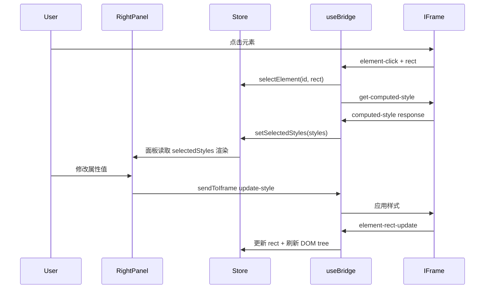
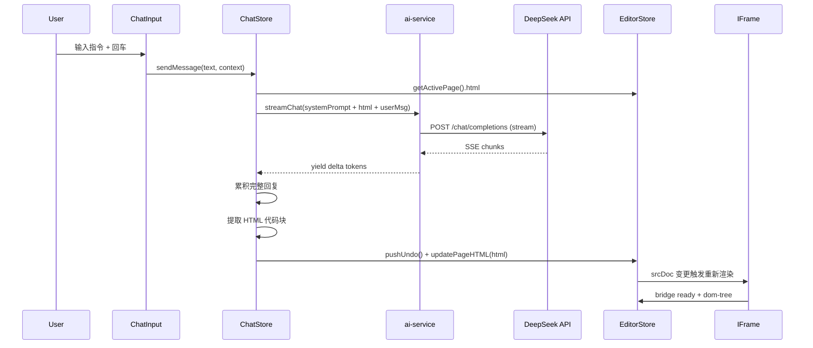

# 属性编辑闭环 + AI 对话集成

## 一、属性编辑闭环

### 现状
- bridge.ts 已支持 `update-style`、`update-text`、`get-computed-style` 消息
- 右侧面板各 Section 当前是**静态 mock 数据**，没有读取真实 computed styles
- 选中元素后 `use-bridge.ts` 会发送 `get-computed-style`，但返回的 styles 没存进 store

### 改动

**1) 扩展 Store** — [editor-store.ts](canvas-editor/src/stores/editor-store.ts)

```typescript
// 新增状态
selectedStyles: Record<string, string> | null

// 新增 action
setSelectedStyles: (styles: Record<string, string>) => void
updateElementStyle: (id: string, prop: string, value: string) => void
```

**2) 连接 bridge 回报** — [use-bridge.ts](canvas-editor/src/hooks/use-bridge.ts)

在 `computed-style` 消息处理中，调用 `setSelectedStyles(data.styles)` 存入 store。选中新元素时自动请求 `get-computed-style`。

**3) 改造右侧面板为可编辑**

- [LayoutSection.tsx](canvas-editor/src/components/RightPanel/LayoutSection.tsx) — X/Y/W/H 改为 `<input>` 输入框，padding 四个值也可编辑。onChange 时调用 `sendToIframe({ type: 'update-style', id, styles: { width: newValue } })`
- [DisplaySection.tsx](canvas-editor/src/components/RightPanel/DisplaySection.tsx) — display/flexDirection/alignItems/justifyContent 的切换按钮已有 UI，点击后通过 bridge 写回
- [TypographySection.tsx](canvas-editor/src/components/RightPanel/TypographySection.tsx) — 从 selectedStyles 读取 fontSize/fontWeight/color，编辑后写回

**4) 数据流**



---

## 二、AI 对话集成（DeepSeek）

### 技术方案

- **接口**: DeepSeek Chat API（`https://api.deepseek.com/chat/completions`），OpenAI 兼容格式
- **调用方式**: 前端 `fetch` + `ReadableStream` 流式读取 SSE
- **Key 管理**: localStorage 存储，设置弹窗配置
- **无需安装额外依赖**，纯 fetch 即可

### 新增文件

**1) `src/services/ai-service.ts`** — AI 调用核心

```typescript
interface AIConfig {
  apiKey: string
  baseUrl: string   // 默认 https://api.deepseek.com
  model: string     // 默认 deepseek-chat
}

function getConfig(): AIConfig {
  return {
    apiKey: localStorage.getItem('sf-api-key') || '',
    baseUrl: localStorage.getItem('sf-api-base') || 'https://api.deepseek.com',
    model: localStorage.getItem('sf-api-model') || 'deepseek-chat',
  }
}

async function* streamChat(
  messages: { role: string; content: string }[]
): AsyncGenerator<string> {
  const config = getConfig()
  const res = await fetch(`${config.baseUrl}/chat/completions`, {
    method: 'POST',
    headers: {
      'Content-Type': 'application/json',
      'Authorization': `Bearer ${config.apiKey}`,
    },
    body: JSON.stringify({
      model: config.model,
      messages,
      stream: true,
    }),
  })
  // 读取 SSE 流，逐 chunk yield delta.content
}
```

**2) `src/stores/chat-store.ts`** — 对话状态

```typescript
interface ChatMessage {
  role: 'user' | 'assistant'
  content: string
  timestamp: number
}

interface ChatState {
  messages: ChatMessage[]
  isStreaming: boolean
  error: string | null
  sendMessage: (text: string, context: ChatContext) => Promise<void>
  clearMessages: () => void
}
```

`sendMessage` 流程：
1. 将当前 page HTML + 选中元素信息 + 用户文本组装为 prompt
2. 调用 `streamChat()`，流式累积 AI 回复
3. 从回复中提取 HTML（正则匹配 `<html>...</html>` 或 ` ```html...``` `）
4. 调用 `pushUndo()` 保存快照，然后 `updatePageHTML()` 更新画布

**3) `src/components/ChatBar/SettingsPopover.tsx`** — API Key 设置弹窗

简洁的弹出框，包含：API Key 输入、Base URL 输入、Model 选择。数据存 localStorage。在 ChatInput 底部工具栏的模型名处点击打开。

### Prompt 设计

```
System:
你是 SpecFlow 画布编辑器的 AI 助手。用户会给你一段 HTML 页面代码和修改指令。
请按照指令修改 HTML，并返回完整的修改后 HTML 代码。
规则：
- 只返回 HTML 代码，用 ```html 包裹
- 保持 Tailwind CSS 类名风格
- 不要删除原有的 script 标签
- 如果用户选中了特定元素，只修改该元素及其子元素

User:
当前页面 HTML:
```html
{currentPageHTML}
```
{如果有选中元素: "当前选中元素: <{tag}> 标签, 标签名: {label}"}
用户指令: {userMessage}
```

### 改造现有组件

**[ChatInput.tsx](canvas-editor/src/components/ChatBar/ChatInput.tsx)**:
- input 的 onSubmit 调用 `chatStore.sendMessage()`
- 发送中禁用输入，显示 loading 状态
- 底部工具栏模型名可点击打开 SettingsPopover
- 回车发送，Shift+回车换行（改为 textarea）

**[ChatHistory.tsx](canvas-editor/src/components/ChatBar/ChatHistory.tsx)**:
- 从 chatStore.messages 渲染真实对话记录
- AI 回复中如果识别到 HTML 变更，显示 "已应用到画布" 的状态指示
- 流式输出时显示 thinking dots 动画

**[ChatBar.tsx](canvas-editor/src/components/ChatBar/ChatBar.tsx)**:
- 控制 history 可见性由 chatStore.messages.length 驱动

### 完整数据流



### CORS 说明

DeepSeek API 默认**支持浏览器 CORS**，前端直接 fetch 可行，无需后端代理。
